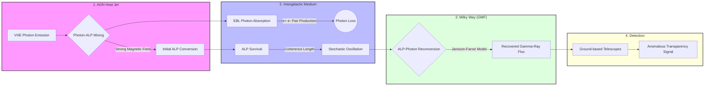

# ALP-Gamma-Propagation-Simulator

Numerical framework for simulating Very High Energy (VHE) gamma-ray propagation and photon-ALP (Axion-Like Particle) oscillation across astrophysical scales.

---

## Table of Contents
1. [Overview](#overview)
2. [Physical Framework](#physical-framework)
3. [Scientific Validation](#scientific-validation)
4. [Installation](#installation)
5. [Execution](#execution)
6. [Repository Structure](#repository-structure)
7. [Propagation Workflow](#propagation-workflow)
8. [Citation](#citation)

---

## Overview
This repository provides a high-performance simulation pipeline designed to model the propagation of VHE gamma rays through three distinct magnetic environments:
* **AGN Jet:** Propagation within the host source's relativistic jet.
* **Intergalactic Medium (IGM):** Travel across cosmological distances including interaction with the Extragalactic Background Light (EBL).
* **Milky Way (GMF):** Traversal through the Galactic Magnetic Field before terrestrial detection.

The simulator quantifies the **Anomalous Transparency** effect, where photon-ALP mixing reduces the effective optical depth ($\tau$) by bypassing EBL-induced pair-production ($e^+e^-$) absorption.

---

## Physical Framework
* **Mixing Engine:** Solves the photon-ALP mixing matrix using a unitarity-preserving solver with numerical stability clipping.
* **Magnetic Field Models:**
    * **AGN:** Coherent field with radial power-law decay ($B(r) \propto r^{-n}$).
    * **IGM:** Turbulent field implemented via a stochastic cellular approach.
    * **GMF:** Full Jansson-Farrar (2012) implementation, including Disk, Halo, and X-field components.
* **EBL Opacity:** Integration of the Dominguez et al. (2011) EBL model for survival probability calculations.

---

## Scientific Validation
Simulations conducted with $g_{a\gamma} = 5 \times 10^{-10} \text{ GeV}^{-1}$ and $m_a = 1 \text{ neV}$ achieved the following benchmarks:

| Metric | Value | Significance |
| :--- | :--- | :--- |
| **Maximum Boost Factor** | **10.58x** | Amplification at $E > 8$ TeV for $D > 800$ Mpc. |
| **Spectral Hardening** | **$\Delta\Gamma = 0.51$** | Measured shift from $\Gamma_{obs} = 4.05$ (EBL) to $3.54$ (ALPs). |
| **Unitarity** | $1.00 \pm 10^{-6}$ | Probability conservation at low energies ($E < 0.1$ TeV). |

---

## Installation

### Prerequisites
* Python 3.8 or higher.
* Pip package manager.

### Steps
1. Clone the repository:
   git clone [https://github.com/lucasrrubio/ALP-Gamma-Propagation-Simulator.git](https://github.com/lucasrrubio/ALP-Gamma-Propagation-Simulator.git)
   cd ALP-Gamma-Propagation-Simulator
2. Create a virtual environment: 
    python3 -m venv .venv
3. Activate the environment:
    * Linux/macOS:
        source .venv/bin/activate
    * Windows:
        .venv\Scripts\activate
4. Install required dependencies:
    pip install -r requirements.txt

## Execution
1. Generate the source catalog:
    python3 utils/generate_source_catalog.py
2. Run the main simulation pipeline:
    python3 main.py
3. Perform spectral analysis:
    python3 utils/plot_final_results.py
    python3 utils/calculate_spectral_index.py

## Repository Structure
* core/: Core physics modules (mixing, fields, propagation).
* data/: Input datasets (EBL fits, source catalogs).
* utils/: Constants, EBL interpolation, and data visualization.
* results/: Default output directory for generated data and plots.

## Propagation Workflow

## Citation
If you use this software in your research, please cite the following dissertation:

    @mastersthesis{rubio2026,
    title={ Probing Axion-Like Particles through VHE Gamma-Ray Propagation: A Simulation of Photon-ALP Oscillations in Astrophysical Magnetic Fields},
    author={Rubio, Lucas Rodrigues},
    year={2026},
    school={Federal University of ABC (UFABC)},
    note={Advisor: Marcelo Augusto Leigui de Oliveira}
    }

And the repository:
    Rubio, L. (2026). ALP-Gamma-Propagation-Simulator. GitHub. [https://github.com/lucasrrubio/ALP-Gamma-Propagation-Simulator](https://github.com/lucasrrubio/ALP-Gamma-Propagation-Simulator)
