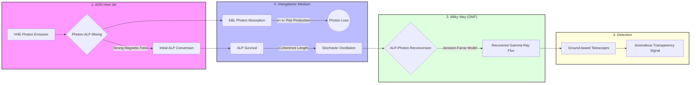

# ALP-Gamma-Propagation-Simulator


Numerical framework for simulating Very High Energy (VHE) gamma-ray propagation and photon-ALP (Axion-Like Particle) oscillation across astrophysical scales.

---

## Table of Contents
1. [Overview](#overview)
2. [Key Features](#key-features)
3. [Physical Framework](#physical-framework)
4. [Installation](#installation)
5. [Data Setup](#data-setup)
6. [Execution](#execution)
7. [Repository Structure](#repository-structure)
8. [Propagation Workflow](#propagation-workflow)
9. [Citation](#citation)

---

## Overview
This repository provides a high-performance simulation pipeline designed to model the propagation of VHE gamma rays through three distinct magnetic environments:
* **AGN Jet:** Propagation within the host source's relativistic jet.
* **Intergalactic Medium (IGM):** Travel across cosmological distances including interaction with the Extragalactic Background Light (EBL).
* **Milky Way (GMF):** Traversal through a high-fidelity Galactic Magnetic Field (GMF) model before terrestrial detection.

The simulator quantifies the **Anomalous Transparency** effect, where photon-ALP mixing reduces the effective optical depth ($\tau$) by bypassing EBL-induced pair-production ($e^+e^-$) absorption.

---

## Key Features
* **Full JF12 Implementation:** Includes Disk arms, Toroidal Halo, and variable-geometry Poloidal X-field (corrected for $r_p < 4.8$ kpc to avoid central singularities).
* **Galactic Coherence Logic:** Turbulent magnetic cells are updated every $0.1$ kpc (integrating 20 steps of $0.005$ kpc) to maintain physical coherence scales during propagation.
* **Eddington-Weighted Sampling:** Event distribution per source is weighted by its Eddington Luminosity ($L_{Edd}$), ensuring a realistic astrophysical population.
* **Numerical Stability:** Evolution engine uses stable diagonalization and *Safe Clipping* to ensure probability conservation (Unitarity $\sum P_i = 1.0$).

---

## Physical Framework
* **Mixing Engine:** Solves the 3x3 photon-ALP mixing matrix in natural units.
* **Magnetic Field Models:**
    * **AGN:** Relativistic jet field with radial power-law decay ($B(r) \propto r^{-n}$).
    * **IGM:** Turbulent field implemented via a stochastic cellular approach.
    * **GMF:** Modified Jansson-Farrar (2012) model with logarithmic phase identification for spiral arms.
* **EBL Opacity:** Integration of the Dominguez et al. (2011) EBL model for survival probability calculations.

---

## Installation

### Prerequisites
* Python 3.8 or higher.
* Pip package manager.

### Steps
1. Clone the repository:
    ```bash
    git clone https://github.com/lucasrrubio/ALP-Gamma-Propagation-Simulator.git
    cd ALP-Gamma-Propagation-Simulator
    ```
2. Create and activate a virtual environment:
   ```bash
   python3 -m venv venv
   source venv/bin/activate
   ```

3. Install dependencies:
   ```bash
   pip install -r requirements.txt
   ```

---

## Data Setup

Before running the simulation, you must extract the necessary EBL opacity files from the installed `ebltable` package:

    ```bash
    python3 utils/scripts/get_ebl_file.py
    ```

This script populates the `data/ebl_models/` directory with the required `.fits` or `.dat` files.

---

## Execution

1. **Generate the source catalog** (Populated based on Eddington Luminosity):
   ```bash
   python3 utils/generate_source_catalog.py
   ```

2. **Run the main simulation pipeline:**
   ```bash
   python3 main.py
   ```

3. **Perform spectral analysis and scientific plotting:**
   ```bash
   python3 utils/calculate_spectral_index.py
   python3 utils/scientific_analysis.py
   ```

---

## Repository Structure

* `core/`: Core physics modules (Mixing matrix, Field models, Propagation engine).
* `data/`: Input datasets, source catalogs, and EBL models.
* `utils/`: Constants, EBL interpolation, and data visualization.
* `utils/scripts/`: Utility scripts for data management and environment setup.
* `results/`: Output directory for generated CSV data and scientific plots.

---

## Propagation Workflow


```mermaid
graph LR
    subgraph AGN ["1. AGN Host Jet"]
        A[VHE Photon Emission] --> B{Photon-ALP Mixing}
        B -->|Strong Magnetic Field| C[Initial ALP Conversion]
    end
    
    subgraph IGM ["2. Intergalactic Medium"]
        C --> D[ALP Survival]
        B --> E[EBL Photon Absorption]
        E -->|e+ e- Pair Production| F((Photon Loss))
        D -->|Coherence Length| G[Stochastic Oscillation]
    end
    
    subgraph MW ["3. Milky Way (GMF)"]
        G --> H{ALP-Photon Reconversion}
        H -->|Jansson-Farrar Model| I[Recovered Gamma-Ray Flux]
    end
    
    subgraph DET ["4. Detection"]
        I --> J[Ground-based Telescopes]
        J --> K[Anomalous Transparency Signal]
    end

    style AGN fill:#f9f,stroke:#333,stroke-width:2px
    style IGM fill:#bbf,stroke:#333,stroke-width:2px
    style MW fill:#dfd,stroke:#333,stroke-width:2px
    style DET fill:#ffd,stroke:#333,stroke-width:2px
```

---

## Citation

If you use this software in your research, please cite the following dissertation:

```bibtex
@mastersthesis{rubio2026,
  title={Probing Axion-Like Particles through VHE Gamma-Ray Propagation: A Simulation of Photon-ALP Oscillations in Astrophysical Magnetic Fields},
  author={Rubio, Lucas Rodrigues},
  year={2026},
  school={Federal University of ABC (UFABC)},
  note={Advisor: Marcelo Augusto Leigui de Oliveira}
}
```
